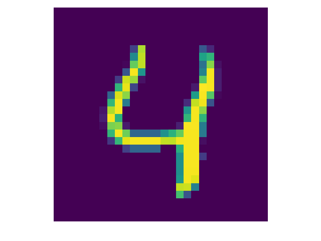
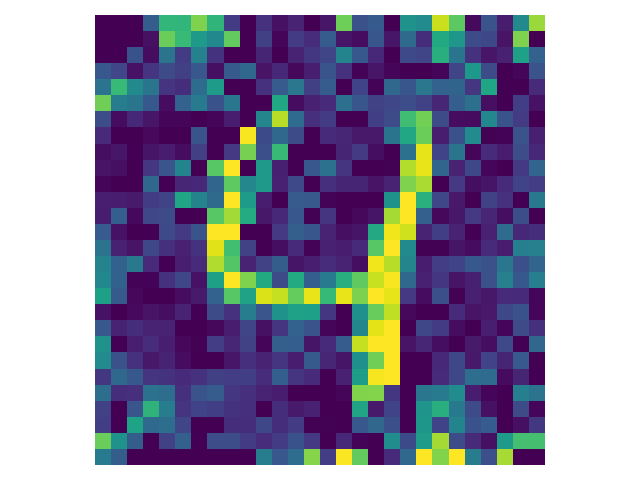
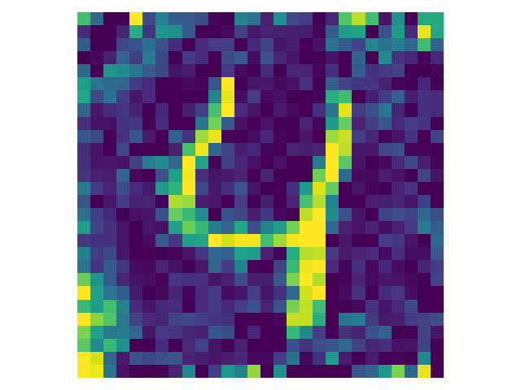
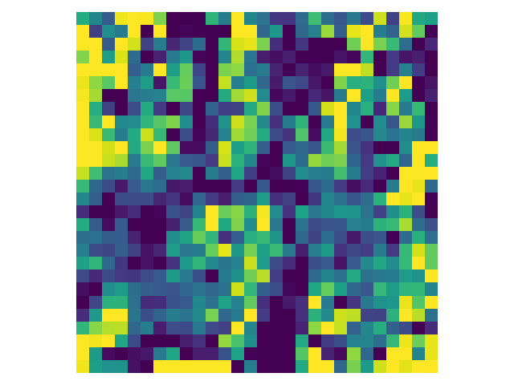

# Ophiuchus: Privacy-Preserving CNN Training with User-Controlled Pseudo-Noise Generation


## Datasets preparation

We evaluate Ophiuchus on four dataset. Our new sampler requires the images to be arranged in the following way:
  ```
  root/dataset/<name>/
    train/
      class1/
        1.jpeg
        2.jpeg
        ...
      class2/
        1.jpeg
        2.jpeg
        ...
    test/
      class1/
        1.jpeg
        ...
      class2/
        1.jpeg
        ...
  ```
* To test on MNIST/Fashion-MNIST, for convenience, you can just use the [torchvision.datasets](https://pytorch.org/vision/stable/datasets.html) provided by PyTorch.
* To test on CelebA, please download dataset from [here](https://www.kaggle.com/datasets/ashishjangra27/gender-recognition-200k-images-celeba), we only use 50K training images and 10K test images.
* To test on CIFAR-10/CIFAR-100, please download dataset from [here](https://www.kaggle.com/datasets/anindya2906/cifar10-raw-images), or you can use [cifar2png](https://github.com/knjcode/cifar2png) to preprocess datasets.

## Installation

### 1. Build nl2pc

nl2pc is a basic library that implements factor-functions for nonlinear layers, such as ReLU and MaxPool.

* **Required Boost::ASIO, [pybind11](https://github.com/pybind/pybind11) and [SEAL](https://github.com/microsoft/SEAL)**

1. If necessary, download pybind11 and SEAL in `extern/`:
    ```
    git submodule add https://github.com/pybind/pybind11.git extern/pybind11
    git submodule add https://github.com/microsoft/SEAL.git extern/SEAL
    ```
2. Create and enter the build directory: `mkdir build && cd build`

3. Configure and build: `cmake .. && make`
   You can find the library in the directories: build/src/nl2pc.cpython-xxx-linux-gnu.so.

    #### Test nl2pc:

   1. Copy built library into example directory: `cp src/nl2pc.cpython-xxx-linux-gnu.so ../example/`

   2. Open two terminals, run `python alice.py` and `python bob.py` in example directory, respectively.

### 2. Install python package
Please adjust the `requirements.txt` to fit your Python/PyTorch environment.
```
pip install -r requirements.txt
```

## Run Ophiuchus

1. Copy nl2pc library into root directory: `cp nl2pc/src/nl2pc.cpython-xxx-linux-gnu.so`
2. Enter the example directory: `cd CryptoTrain/example`

3. Open three terminals and run followings, respectively.

    `python user.py --dataset mnist --epoch 10 --noise`

    `python server1.py --dataset mnist --epoch 10 --ipu 127.0.0.1 --portu 14714`

    `python server2.py --dataset mnist --epoch 10 --ipu 127.0.0.1 --portu 14714`

    You could modify the arguments to test with other datasets.

## Compare the accuracy of noisy training

1. Enter the example directory: `cd PseudoNoise/train`
2. Training with Gaussian noise, run `python train_mnist.py --epoch 10 --noise gauss --sig 1e-3`
   
   Training with contrastive noise, run `python train_mnist.py --epoch 10 --noise pseudo --lam 1`

## Defend against image reconstruction attack

We adopt [IG](https://github.com/JonasGeiping/invertinggradients) as the image reconstruction attack method.

1. Enter the directory: `cd vis`
2. Attack plain training, run `python ig.py --arch LeNet5 --dataset MNIST --gtype w --ltype ce`

   Attack Gaussian noisy training, run `python ig.py --arch LeNet5 --dataset MNIST --gtype w --ltype gauss --sig 1e-3`
   
   Attack contrastive noisy training, run `python ig.py --arch LeNet5 --dataset MNIST --gtype w --ltype oph --lam 1`

| Original | Plain | Gauss. | Oph. |
| :--: | :--: | :--: | :--: |
|  |  |  |  | 